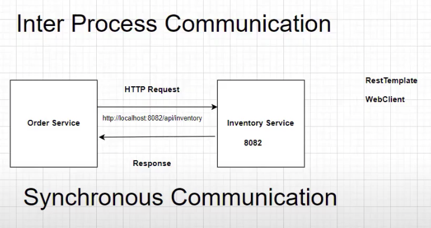

# Spring Boot Microservice

## Overview Diagram

## This branch had integrated the Inter Process Communication
This connection had implemented between Order and Inventory Services
- WebClient - is to send out the request from order to inventory
- RestTemplate - it will respond back the Object pattern

