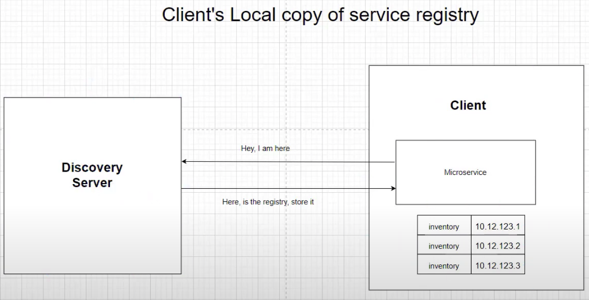
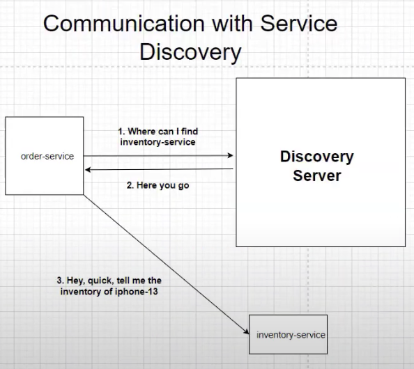
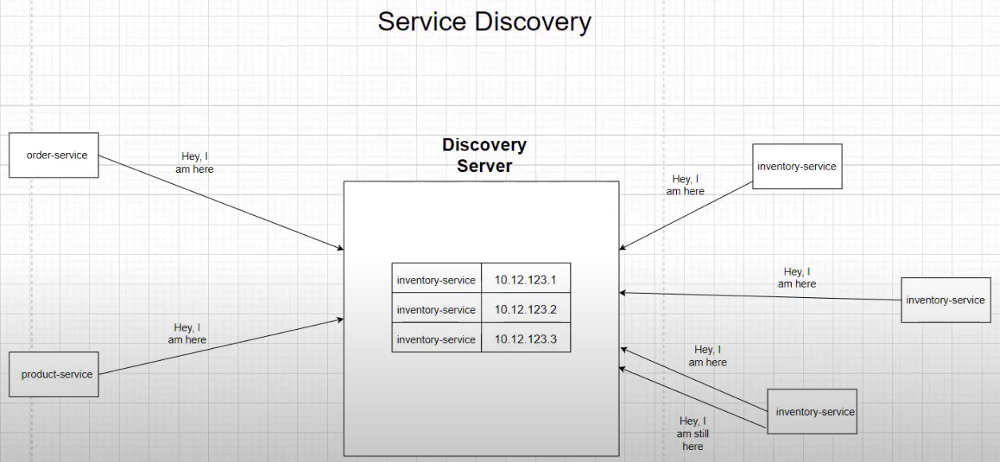

# Spring Boot Microservice

## Overview Diagram

## Discovery Service
discovery service就好像一个map，
会list out全部inventory service的地点，
就算discovery service被shutdown了，
也会有Client's local copy保存着。

**注意⚠️**

如果在discovery service已经shutdown的情况下restart了inventory service，
Client's local cop也不会跟着新的inventory service直到discovery service重启

