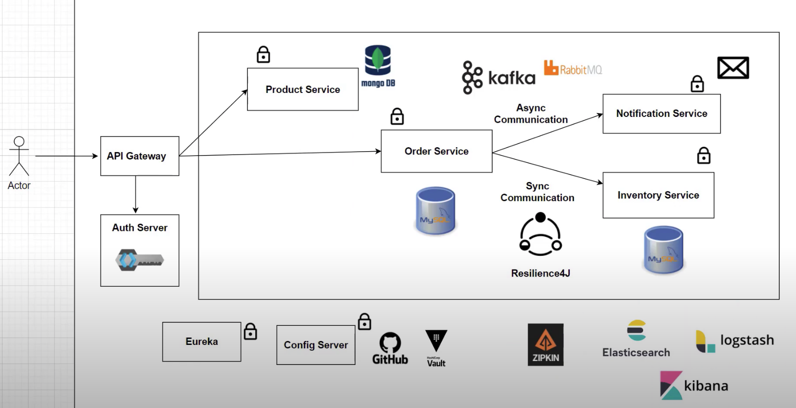

# Spring Boot Microservice

## Overview Diagram

## Inter Process Communication
This connection had implemented between Order and Inventory Services
- WebClient - is to send out the request from order to inventory
- RestTemplate - it will respond back the Object pattern

## Discovery Service
discovery service就好像一个map，
会list out全部inventory service的地点，
就算discovery service被shutdown了，
也会有Client's local copy保存着。

**注意⚠️**

如果在discovery service已经shutdown的情况下restart了inventory service，
Client's local copy也不会有新的inventory service的地点，
直到discovery service重启

## API Gateway
API Gateway帮助所有的module统一了所有的path

正常情况下我们call api需要以指定的Path来读取指定的module

API Gateway为了简化和improve前端开发，API将所有的module统一化
